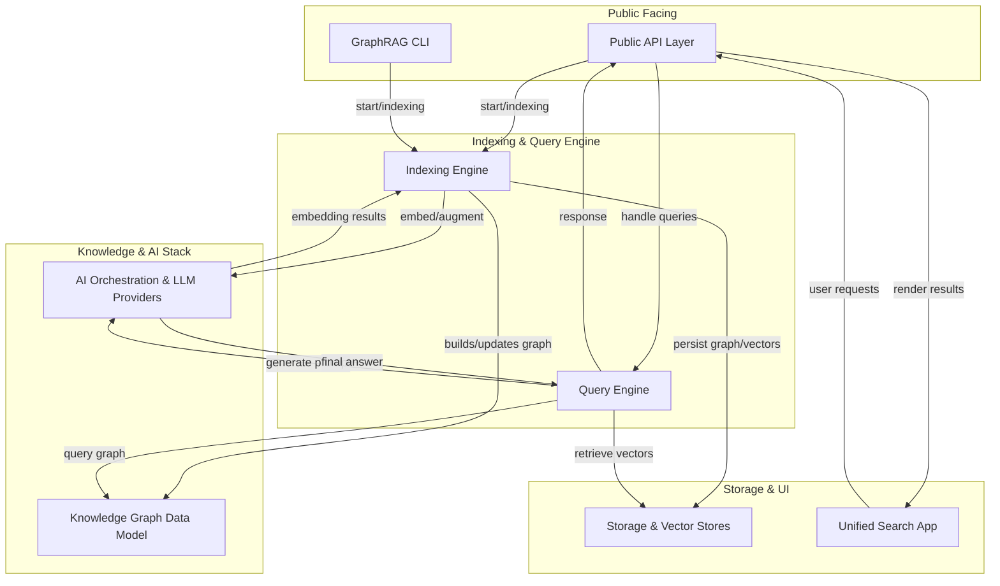

# Architecture

GraphRAG is composed of modular components that interact to index data, construct a knowledge graph, and answer questions with LLMs. The architecture emphasizes separation of concerns, extensibility, and pluggable backends.

Core modular components
- Public API Layer: Public interfaces for indexing, prompt tuning, and querying GraphRAG. File set: graphrag/graphrag/api/__init__.py, index.py, prompt_tune.py, query.py. This layer defines the library-facing API used by clients and subsystems.
- GraphRAG Command-Line Interface (CLI): Typer-based CLI that orchestrates indexing, prompt tuning, and querying workflows via uv/poethepoet. Files: graphrag/graphrag/cli/__init__.py, main.py, index.py, initialize.py, prompt_tune.py, query.py.
- Indexing Engine Core & Workflows: End-to-end data ingestion, graph construction, embedding, and update workflows that build and maintain the knowledge graph index. Key files include run_pipeline.py, utils.py, factory.py, and several workflows like load_input_documents.py, update_text_embeddings.py, create_base_text_units.py, update_entities_relationships.py, and operations for graph creation and embedding.
- Query Engine Core & Interfaces: Query-time context construction, data retrieval, and LLM orchestration utilities used to answer questions against the graph. Files cover context builders, local/entity extraction, global search, and LLM prompts.
- Knowledge Graph Data Model: Core data structures representing documents, entities, relationships, communities, and metadata. Includes models such as document.py, entity.py, relationship.py, community.py, text_unit.py, schemas.py, and types.py.
- AI Orchestration & LLM Providers: Abstractions and backends for language models and tokenization. A registry-based framework decouples providers from GraphRAG’s stack, enabling on-demand creation and lifecycle management. Implementations live under graphrag/language_model and graphrag/language_model/providers.
- Storage & Vector Stores: Storage abstractions and concrete implementations for file/blob storage and vector stores (LanceDB, Cosmos, Azure AI Search, etc.). Core components include FilePipelineStorage, BlobPipelineStorage, and vector_store backends behind a factory. See graphrag/storage and graphrag/vector_stores.
- Unified Search App (Demo UI): A demo UI built around the GraphRAG index for visualization and interactive search, tying together data loading, knowledge loading, multiple search strategies, and result visualization.

How the components interact
1) Ingestion: The Indexing Engine ingests documents, splits them into TextUnits, and extracts entities/relationships to populate the Knowledge Graph Data Model.
2) Graph construction: The indexing flow builds a hierarchical community graph using the Leiden algorithm with configurable parameters, computes degrees, and stores graph snapshots (e.g., graphml) for visualization.
3) Embedding & storage: Embeddings are computed and written to the selected vector store; document/text units and graph artifacts are stored via the Storage layer.
4) Prompt augmentation: During queries, the Query Engine constructs DRIFT/global/local contexts and uses system prompts to guide the LLM, augmented with graph structure and community summaries.
5) Query & reasoning: The LLMs generate answers with access to the context built from the graph and embeddings, enabling retrieval-augmented reasoning.
6) Visualization: The Unified Search App provides a demo UI for exploring the index and querying results.

This architecture supports modular replacement of providers and storage backends, enabling experimentation across different model backends, vector stores, and storage solutions while maintaining a consistent data model and workflow.

## System Diagram

## Components

**Public API Layer**: Public interfaces for indexing, prompt tuning, and querying GraphRAG exposed to clients.

**GraphRAG CLI**: Command-line tooling to orchestrate indexing, querying, and prompt tuning workflows.

**Indexing Engine**: Core data processing pipeline that ingests documents, builds/upgrades embeddings and the knowledge graph.

**Query Engine**: Context construction, retrieval, and LLM orchestration to answer questions with graph context.

**Knowledge Graph Data Model**: Data structures for documents, entities, relationships, and graphs that form the knowledge base.

**AI Orchestration & LLM Providers**: Abstractions and backends for language models, tokenization, and prompt management.

**Storage & Vector Stores**: Storage abstractions and concrete vector stores for graphs, embeddings, and documents.

**Unified Search App**: Demo UI for searching, loading data, and visualizing the knowledge graph results.

